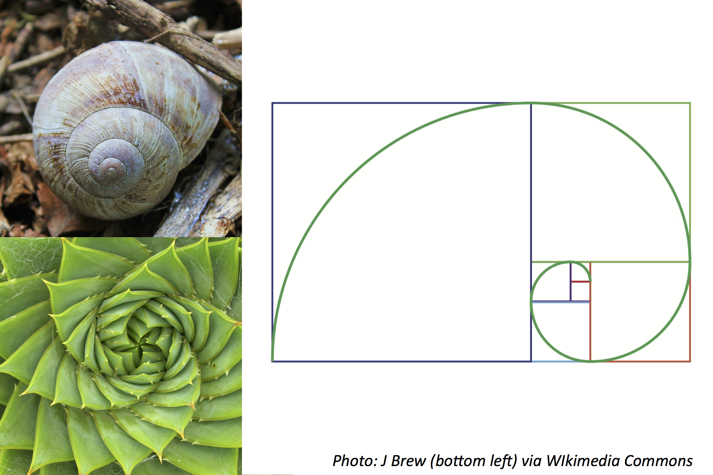

# OOP_2024_Midterm_Problem1

---

## Type and Loop (40 points)

---

다음 그림은 피보나치 수열이 자연 현상에서 나타는 예제들이다. 피보나치 수열은 첫째 항은 0, 둘째 항은 1이며 그 뒤의 모든 항은 바로 앞 두 항의 합인 수열로 수식으로 나타내면 아래와 같다.
The following image is an example of how the Fibonacci sequence appears in natural phenomena. The Fibonacci sequence starts with 0 and 1, and each subsequent term is the sum of the two preceding ones. The sequence can be represented mathematically as follows:

```
f_n = f_{n-1} + f_{n-2}
```


_Figure: Fibonacci Sequence_

`term`라는 변수에 항을 입력 받아, 해당 항까지의 모든 피보나치 수열을 전개하는 코드를 구현하고자 한다. 더불어 아래 조건들을 만족해야한다.
We aim to implement a code that receives a term in the variable `term` and unfolds the Fibonacci sequence up to that term. Additionally, the implementation must meet the following conditions:

- 50번째 이상의 항도 다룰 수 있어야 한다. It should be able to handle terms beyond the 50th.
- 음수의 항은 예외처리를 구현하시오. Negative terms should be handled with an exception.

특정 입력에 대한 출력들은 아래와 같다. Specific examples of input and output are as follows:

```
Input: 10
Output: 0 1 1 2 3 5 8 13 21 34
```

```
Input: -1
Output: The given term is not a positive integer.
```

---

평가 기준은 아래와 같으며, 본 문제는 각 기능별 method 구현이 필수적이진 않음. The evaluation criteria for the problem are as follows, and it's not mandatory to implement separate methods for each functionality:

1. **20 points:** 피보나치 수열 출력 성공 Successful output of the Fibonacci sequence
2. **10 points:** 50 이상의 큰 항에 대한 처리 Handling terms larger than 50
3. **10 points:** 양에 정수에 대한 예외 처리 Exception handling for non-positive integers

---
