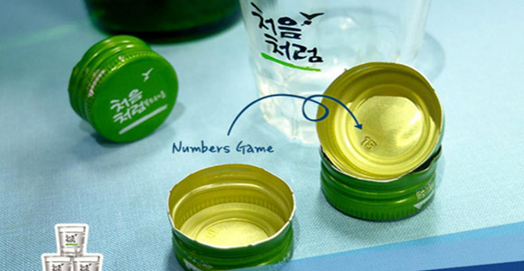

# OOP_2024_Midterm_Problem2

## Class (60 points)

### Up Down Game!

**Guess the number under the soju bottle cap!**  
**If you don't guess within 10 tries, you take a shot!**  
**If you guess correctly, I take a shot!**


_Figure: Guess the Number_

This game involves guessing a randomly assigned number between 0 and 50 within 10 attempts. After each guess, the game will indicate how close you are to the correct answer:

- If the guessed number is less than the target: Output **DOWN**
- If the guessed number is more than the target: Output **UP**
- Update the `counter` value and if it exceeds 10, output **Game Over!** and end the game.
- If the correct number is guessed within 10 tries, output **BINGO!** and end the game.

Refer to the `Problem2.java` code and complete the `GuessNumberGame` class for submission.

### Output examples based on the guessing process:

**CASE 1**

```
I'm thinking of a number from 0 to 50.
Try to guess it.
[Trial 1] Guess the Number: -1
Error! Number must be greater than equal to 0
[Trial 1] Guess the Number: 0
UP
[Trial 2] Guess the Number: 50
DOWN
[Trial 3] Guess the Number: 25
DOWN
[Trial 4] Guess the Number: 12
UP
[Trial 5] Guess the Number: 18
DOWN
[Trial 6] Guess the Number: 15
UP
[Trial 7] Guess the Number: 17
BINGO! The answer was 17
```

**CASE 2**

```
I'm thinking of a number from 0 to 50.
Try to guess it.
[Trial 1] Guess the Number: 0
UP
[Trial 2] Guess the Number: 0
UP
...
[Trial 10] Guess the Number: 0
UP
Game Over !! You failed more than 10 times.
```

### Evaluation Criteria

1. **15 points:** Declare necessary fields for the `GuessNumberGame` class.
2. **15 points:** Complete the constructor, which should allow setting a desired range, typically between [0, 50].
3. **15 points:** Complete the `setTargetNumber` method to assign a random number within the specified range.
4. **15 points:** Complete the `getIntWithinRange` method that ensures the input value is within the specified range, prompting re-entry if it's not.

---
